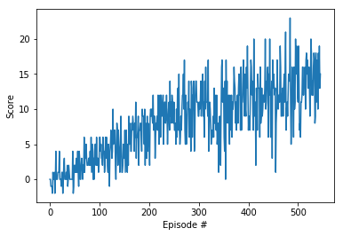

# Project 1 Report

## Learning Algorithm

The implementation is a vanilla Deep Q-Network with three fully connected layers: two hidden layers of 64 units each with ReLU activation and an output layer of 4 units. The hyperparameters used are:

| Hyperparameter | Value |
| ------------- | ------------- |
| first hidden layer units | 64 |
| second hidden layer units | 64 |
| replay buffer size | 1e5 |
| batch size | 64 |
| discount factor (gamma) | 0.99 |
| tau | 1e-3 |
| learning rate | 5e-4 |
| update the network every __ time steps | 4 |
| number of episodes | 2000 |
| max time steps per episode | 1000 |
| starting epsilon value | 1.0 |
| ending epsilon value | 0.01 |
| epsilon decay rate | 0.995 |

## Plot of Rewards

The plot below shows that, after 546 episodes, the agent is able to receive an average reward of 13.06 over the last 100 consecutive episodes.

## Ideas for Future Work

Ideas for improving the agent's performance are as follows:
- Attempt a double DQN, dueling DQN, and prioritized experience replay.
- Attempt a Rainbow algorithm to see how fast it would solve the task 
